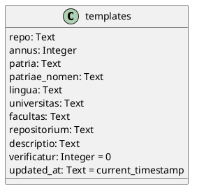

\newpage

## Database

```plantuml
@startuml
class templates {
    repo: Text
    annus: Integer
    patria: Text
    patriae_nomen: Text
    lingua: Text
    universitas: Text
    facultas: Text
    repositorium: Text
    descriptio: Text
    verificatur: Integer = 0
    updated_at: Text = current_timestamp
}
@enduml
```
