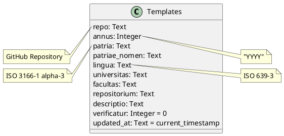

\newpage

## Database

```plantuml
@startuml

class Templates {
    repo: Text
    annus: Integer
    patria: Text
    patriae_nomen: Text
    lingua: Text
    universitas: Text
    facultas: Text
    repositorium: Text
    descriptio: Text
    verificatur: Integer = 0
    updated_at: Text = current_timestamp
}
note left of Templates::repo
    GitHub Repository
end note

note right of Templates::annus
    "YYYY"
end note

note left of Templates::patria
    ISO 3166-1 alpha-3
end note

note right of Templates::lingua
    ISO 639-3
end note

@enduml
```
